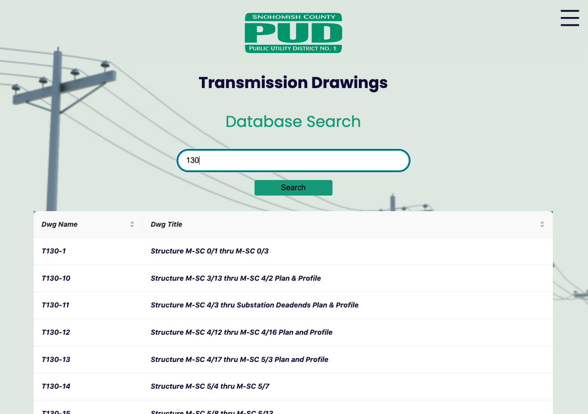
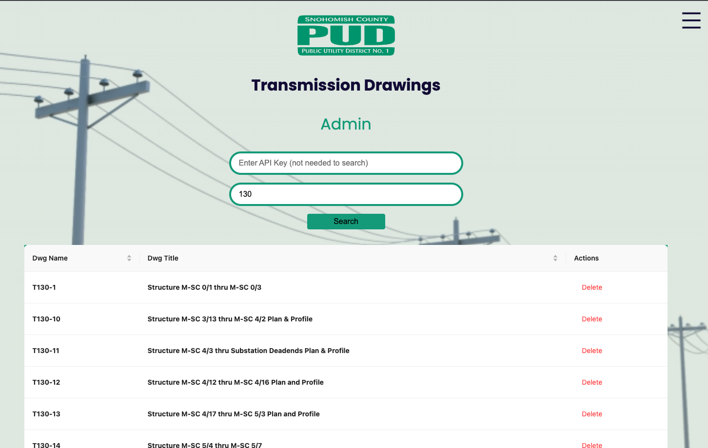

# Front-End

## Purpose
Provide users with the ability to interact with the Snohomish County PUD transmission drawings database.  
## Getting Started
#### To run the application locally:
1. Clone the `tx_dwgs` repository if you haven't done so already.

2. Change into `front-end` directory.

    ```
    cd front-end
    ```

3. Install the npm packages.

    ```
    npm install
    ```

4. Start the application.

    ```
    npm run dev
    ```

## Application Design & Structure
### Tools
 - [React](https://react.dev/)
 - [NextJS](https://nextjs.org/)
 - [Ant Design](https://ant.design/)
 - [React Icons](https://github.com/react-icons/react-icons#readme)

 ### Design Choices
 We decided to create a React application via the NextJS framework.  We initialized the NextJS framework with the `app` directory.

 ### General Structure
- The `front-end` directory holds all the code for the UI.
- Within the `front-end` directory, the `app` folder holds all the code for the views, components, and styling.
    - Per NextJS standards, the `page.jsx` file in the `app` directory is the default/landing view, and other routes/views are defined in subdirectories of the `app` directory.
    - Resuable components exist within the `components` directory.
    - All styles are defined within the `globals.css` file. 

## Views
### Search
The default view which allows any user to query the transmission drawing database and view the results.  See the API documentation **Response** section for details on what responses will be returned from different query inputs.



### Data
Provides insights and analysis of the transmission drawing data.

### Admin
Currently allows users with a valid API key to perform Delete actions on search result records.



## GitHub Action Workflows
### ESLint
- Pertains to the `front-end` directory.
    - Includes `.js` and `.jsx` files types.
    - Runs on all pushes to GitHub and PRs/merges into `main`.
- Implements [ESLint Standard](https://github.com/standard/eslint-config-standard) configuration.
