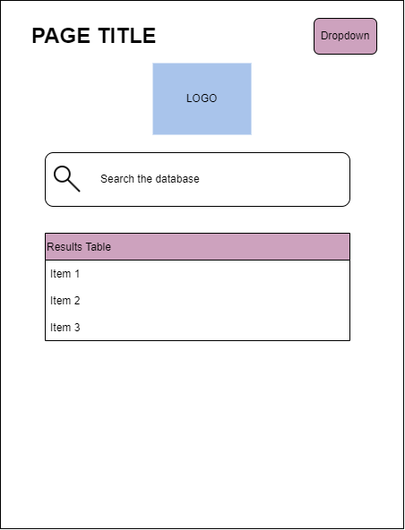
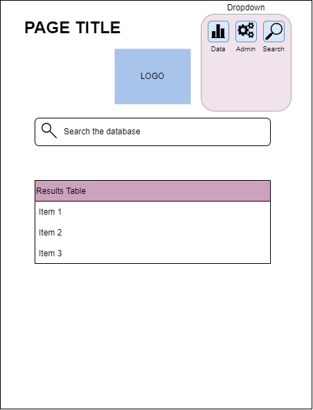

# User Interface (UI/UX)
To provide a seamless user experience, it is essential to have a simple and intuitive interface that doesn't need any training or instruction. This can be achieved by designing the interface to be familiar to users by mimicking other commonly used tools such as search engines, desktop search, and web interfaces.

## Wireframes
The attached wireframes are an initial design that will be adjusted based on client feedback as the application evolves.

 
The front page UI functions as a landing page for the user interface. A search bar is provided to allow the user to enter their query. Once the search is executed, which may happen automatically or prompted by the user, results are displayed in a table or display below.

 
An option to filter results is available on the front page UI. This can be applied before or after a search is conducted. If used before, it will modify the query sent to the backend. If used after, it will filter the results.

 
The dropdown UI can be used to navigate between different pages and features of the site, with the search function being the main feature. Other functions can be added depending on the client's needs and preferences.

 
For a more in-depth analysis or quick information summary, the data visualization UI shows a possible dashboard format on a separate page.